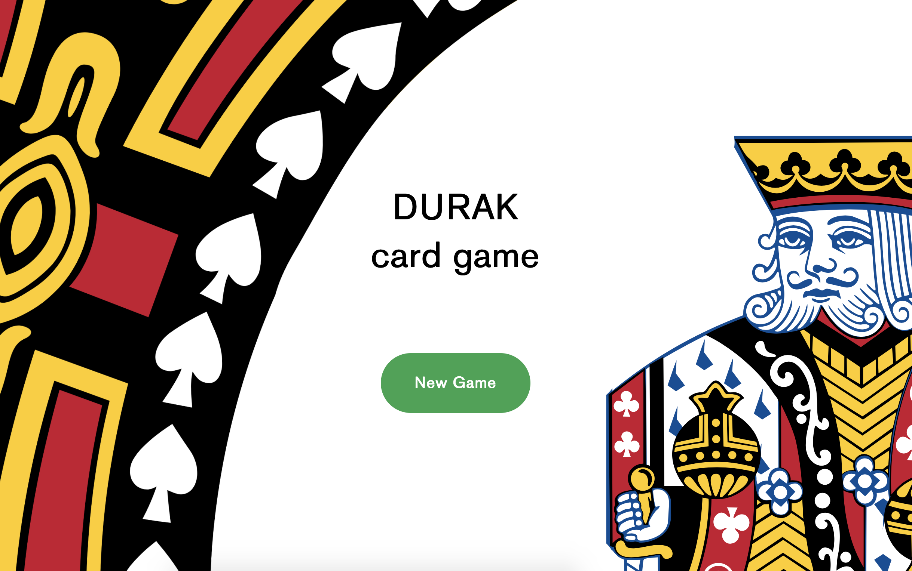
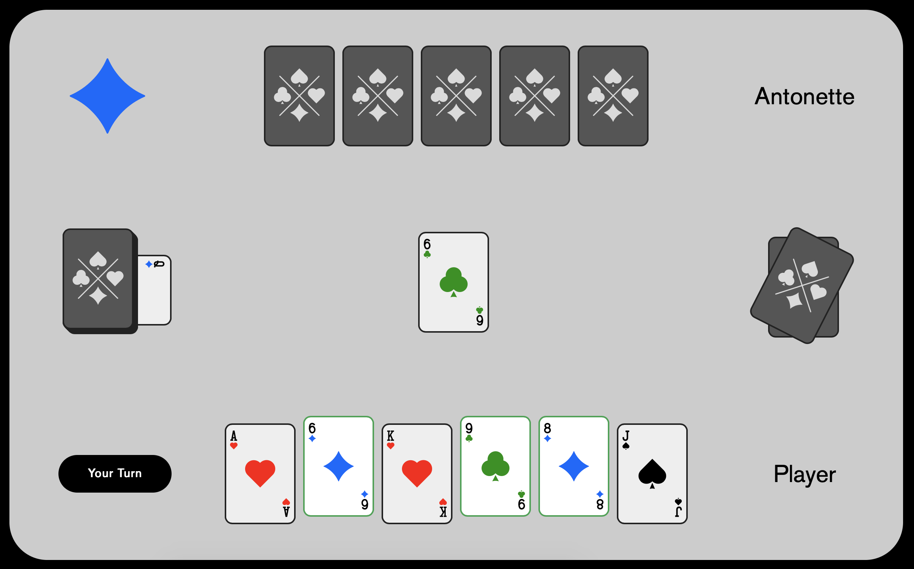

Durak (Fool) card game

[Demo](https://bessondi.github.io/Card-Game/build/)

---

«Durak» or «Fool» is a traditional Russian card game that is popular in many post-Soviet states. It is Russia's most popular card game, having displaced Preferans. It has since become known in other parts of the world. The objective of the game is to shed all one's cards when there are no more cards left in the deck. At the end of the game, the last player with cards in their hand is the «durak or «fool».

«Дурак» - традиционная русская карточная игра, популярная во многих постсоветских странах. Цель игры - сбросить все карты после того, как в колоде больше не осталось карт. Игрок, у которого остались карты - «дурак».

